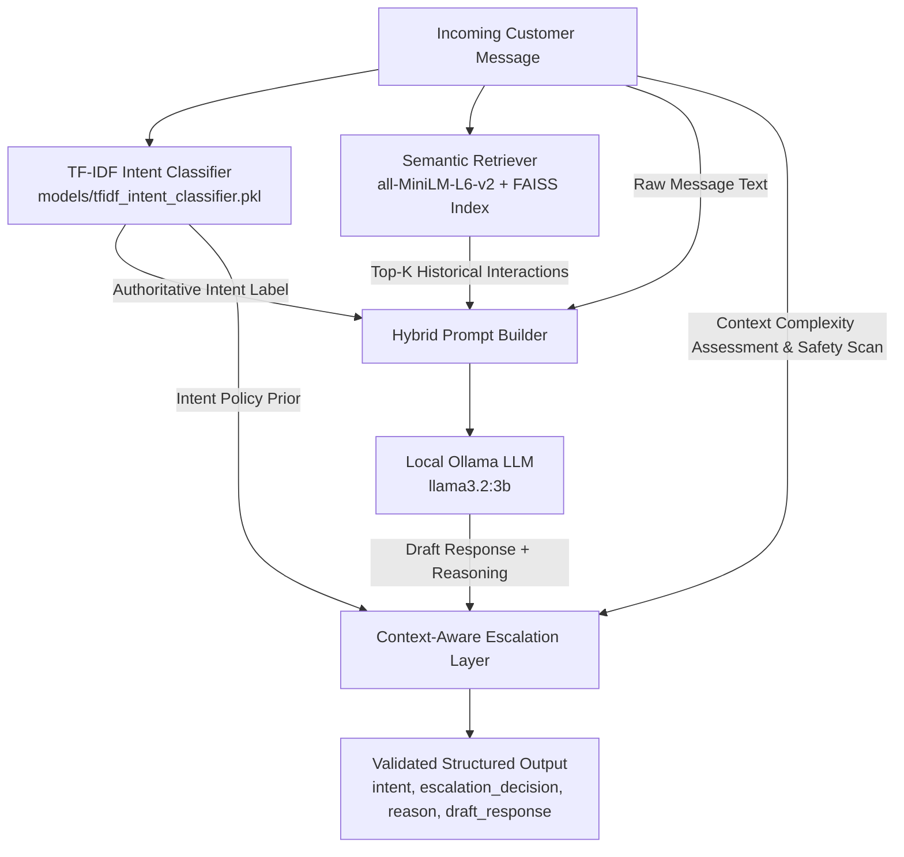

# Hybrid Support Agent Architecture Specification (Updated Step 15)

## Executive Summary

The **Hybrid Support Agent Architecture** (`HybridSupportAgent`) combines the authoritative classification accuracy of a deterministic TF-IDF classifier ($93.0\%$ intent accuracy) with dense FAISS semantic retrieval, local Ollama response generation (`llama3.2:3b`), and a **3-Level Context-Aware Escalation Layer**.

---

## 1. Architectural Overview & Separation of Concerns



### Module Responsibilities

| Subsystem | Technology / Artifact | Responsibility | Determinism |
| :--- | :--- | :--- | :--- |
| **Intent Routing** | `TfidfIntentClassifier` (`models/tfidf_intent_classifier.pkl`) | Classifies incoming message into exactly one of the 13 taxonomy intents. Acts as the **authoritative single source of truth** for intent routing. | **Deterministic (100%)** |
| **Semantic Retrieval** | `SemanticRetriever` (`models/retrieval/faiss_index.bin`) | Fetches top-$K$ ($k=3$) relevant historical `@AmazonHelp` conversations to supply stylistic precedent and context. | **Deterministic (100%)** |
| **Generative Drafting** | `OllamaClient` (`llama3.2:3b` at temperature `0.0`) | Drafts an empathetic, polite customer service response and natural language explanation, conditioned on the **fixed intent** and retrieved context. | **Bounded Generative** |
| **Context-Aware Escalation Layer** | `assess_contextual_escalation` (`src/llm/hybrid_agent.py`) | Evaluates Level 1 Hard Safety Overrides, Level 2 Intent Policy Priors, and Level 3 Contextual Complexity (Informational FAQ vs. Active Customer Dispute). | **Deterministic (100%)** |

---

## 2. 3-Level Context-Aware Escalation Architecture

Rather than relying on isolated single-word triggers or unconditionally forcing intent-to-escalation mappings, the escalation engine applies a hierarchical 3-level assessment:

### Level 1: Deterministic Hard Safety Overrides (Unconditional Escalation)
Explicit, high-risk security, fraud, human-agent, or legal scenarios that **must always escalate** to a human agent, evaluated via contextual multi-word regexes:
- **Explicit Human Agent Requests**: `speak to a human`, `talk with a representative`, `transfer to a supervisor`, `real person please`.
- **Account Compromise & Takeover**: `account has been hacked`, `someone else logged into my account`, `unauthorized login/access`.
- **Financial Fraud / Stolen Payment**: `unauthorized charge`, `fraudulent transaction`, `don't recognize this charge`, `stolen card`.
- **Severe Safety / Legal Threats**: `legal action`, `contacting my lawyer`, `taking you to court`, `police report`, `driver threatened/assaulted me`.
- **Direct Theft Claims**: `package was stolen from porch`, `stolen package claim`.

> [!NOTE]
> Isolated generic words (e.g. "person" in *"the delivery person was very helpful"*, or "police" in *"driver slinked away when I called the police"*) do **not** trigger Level 1 escalations.

### Level 2: Intent Policy Priors
The predicted intent serves as a baseline policy prior:
- **High-Risk Prior (7 Intents)**: `delivery_delay`, `order_cancellation`, `refund_inquiry`, `damaged_or_wrong_item`, `payment_and_billing_issue`, `account_access_and_security`, `other_or_unsupported`.
- **Automation Prior (6 Intents)**: `order_tracking_inquiry`, `prime_membership_inquiry`, `digital_and_device_troubleshooting`, `promotion_and_discount_inquiry`, `driver_and_packaging_feedback`, `general_product_and_service_faq`.

### Level 3: Contextual Complexity Assessment (Informational vs. Active Dispute)
Evaluates whether the customer is asking a **general procedural / FAQ question** versus reporting an **active unresolved transaction dispute**:
- **Informational Inquiries**: Questions regarding standard procedures, timelines, warranty terms, or policy guidelines (e.g., *"How long does a refund normally take?"*, *"How do I deal with warranty on an Amazon Basics item?"*, *"What are the requirements for Trade-in?"*, *"Do you accept Visa?"*).
  - **Decision**: Routed to **`AUTO_HANDLE`** with self-service links and standard policy guidance.
- **Active Customer-Specific Disputes**: Inquiries containing specific order numbers, active delay claims (*"3 days late"*, *"still waiting"*), damaged goods (*"broken"*, *"shattered"*), duplicate debits (*"charged twice"*), or explicit cancellation commands (*"cancel my order"*).
  - **Decision**: Routed to **`ESCALATE`** under high-risk intent priors.

---

## 3. Fallback & Fault Tolerance

To ensure 100% operational uptime in production environments:
1. **LLM Timeout / Connection Failure**: If the Ollama server is unreachable or fails to generate valid JSON within the retry budget, `HybridSupportAgent` falls back to a deterministic template response based on the predicted intent and contextual escalation assessment.
2. **Strict Schema Validation**: The returned output is guaranteed to contain valid taxonomy labels (`intent \in VALID_INTENTS`, `escalation_decision \in {"AUTO_HANDLE", "ESCALATE"}`).

---

## 4. API & Interface Specifications

### Class: `HybridSupportAgent`
```python
from src.llm.hybrid_agent import HybridSupportAgent

agent = HybridSupportAgent()
result = agent.process_message("Where is my package? The tracking number is AMZL88921.")

# Result Schema:
# {
#   "customer_message": "Where is my package? The tracking number is AMZL88921.",
#   "intent": "order_tracking_inquiry",
#   "escalation_decision": "AUTO_HANDLE",
#   "escalation_reason": "Standard order_tracking_inquiry inquiry suitable for automated resolution. ...",
#   "draft_response": "You can track your parcel anytime via Your Orders at https://www.amazon.com/your-orders.",
#   "retrieved_examples": [...],
#   "intent_source": "tfidf_classifier",
#   "model": "llama3.2:3b"
# }
```

### CLI Command
```bash
python -m src.llm.hybrid_agent --message "How long does a refund normally take to appear in my account?"
```

---

## 5. Verification & Unit Test Suite

The test suite in `tests/test_hybrid_agent.py` verifies 22 test cases:
1. **`TestContextAwareEscalationLayer`**:
   - Hard safety overrides (human requests, account compromise, fraud, theft).
   - Benign words handling ("person", "police", venting remarks remain `AUTO_HANDLE`).
   - Informational inquiries vs. active disputes across refund, cancellation, warranty, trade-in, and billing.
   - Standard automated intents remaining `AUTO_HANDLE`.
2. **`TestHybridPromptBuilder`**: Context and locked intent conditioning in prompt generation.
3. **`TestHybridSupportAgent`**: Pipeline execution, TF-IDF intent locking, and graceful fallback on LLM failure.
4. **`TestHybridAgentIntegrationWithRealModels`**: End-to-end integration test with real `tfidf_intent_classifier.pkl` and FAISS vector index.
